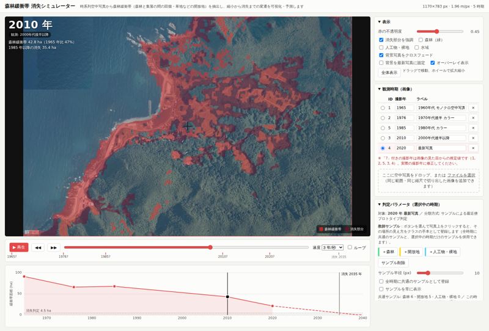

# 森林緩衝帯 消失シミュレーター

時系列の空中写真（同じ範囲・同じ縮尺で切り出したもの）から **森林緩衝帯**（住宅・田畑などの人間の生活空間と密な森林の間にある、間伐地・疎林・草地の帯）を抽出し、
その分布を **赤色の半透明オーバーレイ** で写真に重ねて表示します。年代スライダーやアニメーションで緩衝帯がどのように縮小し、
最終的に消失へ至るかを視覚的に確認でき、観測された減少傾向を延長して **消失予測年** とその空間パターンをシミュレートします。

ブラウザだけで動く静的な Web アプリです（ビルド不要・外部ライブラリなし）。



## 使い方

```bash
# 1) 静的ファイルサーバーで公開する（file:// では画像の画素が読めないため必須）
npx serve -l 8080 .        # または python3 -m http.server 8080
# 2) ブラウザで http://localhost:8080/ を開く
```

`node tools/build_single.mjs`（または `npm run build`）で JS・CSS・画像を埋め込んだ単一ファイル `dist/forest-buffer-simulator.html` ができます。こちらはサーバー不要で、ダブルクリックで開けます。

`npm install` すると `npm start`（サーバー起動）と `npm run export`（後述のバッチ書き出し）が使えます。

### 画面の構成

| 場所 | 内容 |
|---|---|
| 左上の写真 | 現在の年の空中写真に、森林緩衝帯（赤）と「基準の時期以降に消失した部分」（紫）を重ねて表示。消失の基準は「表示」パネルで、過去のすべての時期の和集合（既定。それ以前に一度でも緩衝帯だった場所で現在は無い部分）／直前の観測時期／最初の観測時期／任意の観測時期に固定、から選べる。ドラッグで移動、ホイールで拡大縮小 |
| タイムライン | 再生／一時停止、前後の観測時期へジャンプ、年スライダー（0.5 年刻み）、速度、ループ。目盛りの `?` は撮影年が推定値であることを示す |
| グラフ | 緩衝帯面積 (ha) の推移。実線が観測（間は線形補間）、破線が予測、点線が消失判定面積。クリックでその年へ移動 |
| 右パネル | 表示設定 ／ 観測時期（撮影年・ラベルの編集、画像の追加・除外） ／ 判定パラメータ ／ 緩衝帯の定義・手動修正 ／ シミュレーション ／ 統計 ／ 書き出し・設定 |

スマートフォン・タブレットでも動作します（1 本指でドラッグ移動、2 本指でピンチ拡大縮小、タップでサンプル登録・頂点追加、「範囲を確定」ボタンで解析範囲を確定）。初回の分類に数秒かかります。

キーボード: `Space` 再生/停止、`←` `→` 0.5 年移動（`Shift` で 5 年）、`Esc` 描画・サンプル登録の終了。

### 分類と緩衝帯の定義

1. **水域**: カラー参照画像（`data/config.js` の `waterReference`）で「その画像内で相対的に青が強くなめらかな画素」を海の候補とし、過半数の画像で候補になった画素を海とします。海岸線から `coastBandM`（既定 25 m）の帯と、各時期で水域に接する白波・砂浜・岩礁（明るく彩度の低い画素）は陸域から除きます。
2. **土地被覆 4 クラス**: 画素ごとの特徴量 7 つ（平滑化した輝度・彩度・緑らしさ・局所テクスチャ・局所最小輝度・広域テクスチャ・エッジ密度）を、**教師サンプル**（写真上でクリックして置く円）から学習したクラスのプロトタイプと比べ、最も近いクラスに割り当てます（共通分散の最近傍プロトタイプ判定）。
   - **森林（密）** … 樹冠が閉じた林
   - **疎林・草地** … 間伐された林、草地、耕作をやめて間もない土地など（緩衝帯の候補）
   - **田畑** … 耕作地（生活空間）
   - **人工物・裸地** … 建物・道路・岩など（生活空間）
   1 位と 2 位のクラスの距離差が「判定の厳しさ」（既定 4。全時期共通）未満の画素は確信なしとして森林扱いにし、緩衝帯にも田畑にも数えません。近傍多数決（既定 半径 2 px）で塩胡椒状のノイズを除きます。サンプルは全時期共通のものと時期ごとのものを併用できます。森林・田畑のサンプルが無い時期は輝度のしきい値（大津法）で代替します。疎林・草地のサンプルが無い時期は緩衝帯を判定できません。
3. **後処理**: 森林マスクのクロージング／オープニング（整形半径）と、小さな断片の除去（最小領域）。
4. **生活空間** = 住居の点（各時期の写真で屋根を 1 棟ずつ確認し、時期ごとに登録: 1965 年 25、1976 年 33、1985 年 35、2010 年 30、2020 年 41 点。周囲「住居の半径」既定 20 m）∪ 住宅地の多角形（任意）∪ 田畑 ∪ 人工物。任意で「人工物の周囲 N m」も加えられます。住居は家のアイコンで表示され、画面上でクリックして追加・削除できます。
5. **森林緩衝帯** = 生活空間の周囲「帯の幅」（既定 100 m）以内の陸域のうち、疎林・草地に分類された部分。ただし森林に面した側だけを対象にするため、「森林からの距離」（既定 40 m）以内にまとまった森林（「森林とみなす塊の最小面積」既定 1 ha 以上。田畑の間の木立や屋敷林は含めない）がない部分と、海岸から「海岸から離す距離」（既定 60 m）以内の部分は除きます。生活空間に数える田畑・人工物は一定以上の区画（既定 0.15 ha）に限り、0.05 ha 未満の斑点は除きます。「生活空間との接続」（既定: 条件なし）を設定すると、生活空間に接する塊だけに限定できます。帯の中が密な森林になった部分は「緩衝帯が失われた場所」で、表示設定の「帯のうち森林化した部分」で確認できます。帯の幅を 0 にすると、疎林・草地すべてを緩衝帯とします。

モノクロ写真では彩度と緑らしさが常に 0 になりますが、同じ手順で分類できます。判定結果は必ず写真と見比べ、
「判定の傾き」（負で森林寄り、正で開放地寄り）やサンプルの追加、ブラシ修正で整えてください。

### 補間と消失シミュレーション

- **観測期間内**（最初〜起点の観測年）: 隣り合う 2 時期のマスクの差分を取り、消失した画素を「森林境界に近いものから順に」区間内で等速に反転させて任意の年のマスクを作ります。面積はそのまま線形補間になります。
- **予測**（起点の観測年以降）: 観測された緩衝帯面積に傾向線を当てます。
  - 線形（一定面積/年）／指数（一定割合/年）／最終区間の変化率／手動の年率
  - 起点の観測面積に接続した面積スケジュール A(t) を作り、消失判定面積（最初の観測面積の x %、既定 5 %）を下回る年を **予測消失年** とします。
  - 空間パターンは距離ベースの侵入モデル: 森林境界からの距離が近い開放地ほど早く森林化します。「ゆらぎ (m)」で自然な凹凸を、「集落近傍の維持 (m)」で人工物近くの畑が維持されやすい効果を加えられます。
- **予測の起点** を過去の時期にすると、その時点までの観測だけで予測した結果と、実際の観測を比べられます（ハインドキャスト）。

これは面積傾向の外挿と単純な空間ルールによる **可視化のためのシミュレーション** です。土地利用政策や個々の農地の動向は考慮していません。

### 現地写真（スポット写真）の表示

`data/photos/mauracho/` の現地写真 86 枚（2026-09-23 撮影、EXIF に GPS・撮影方向あり）を、俯瞰写真の上に青い点で表示します。
点にカーソルを合わせる（または選択する）と撮影方向の矢印が出ます。ピンをクリックすると写真・撮影時刻・標高・方向・座標と、**その地点の現在の年の判定**（緩衝帯／田畑／森林など）を表示し、「前／次」で順に確認できます。「表示」パネルの「現地写真のピン」で切り替えます。

- 位置合わせ: 画素と緯度経度の対応（`data/config.js` の `georef`）は、GPS 軌跡を最新写真の道路・畑の縁に最もよく重なるように推定したもので、誤差は 10 m 程度です。地理院地図の中心座標が分かれば `georef` を置き換えて精度を上げられます。
- `photos.json` は EXIF から生成した一覧（緯度・経度・標高・時刻・方向）、`thumbs/` はピン用の 320 px、`mid/` は表示用の 900 px 縮小版です。原本は `IMG_*.JPG`（長辺 2048 px）。
- 単一ファイル版には 320 px のサムネイルだけを埋め込みます。

### 書き出し

- 現在のフレームの PNG、観測・予測の面積表 CSV、設定（撮影年・パラメータ・サンプル・手動修正・解析範囲）の JSON
- アニメーションの WebM 動画（Chrome / Edge / Firefox）
- バッチ: `node tools/render_frames.mjs --out out/frames --step 5` でヘッドレス Chromium が観測年と 5 年ごとの予測年のフレーム PNG・`stats.json`・`areas.csv` を書き出します（`npm install` で playwright を入れておく。ブラウザ本体は `npx playwright install chromium`）。

設定はブラウザの localStorage に自動保存されます。「初期化」で `data/config.js` の既定値に戻ります。

## 採用している定義（確認済み）

- **森林緩衝帯の定義**: 田畑や住宅地は人間の生活空間であり緩衝帯ではない。緩衝帯は、生活空間の外側で密な森林との間にある間伐地・疎林・草地の帯（既定で生活空間から 50 m 以内）。住宅は各時期の写真で屋根の位置を点で指定（時期ごとに 25〜41 棟、半径 20 m）、田畑・人工物は分類結果から自動判定。
- **解析範囲**: 画像全体（解析範囲の多角形は未設定）。
- **消失判定と予測モデル**: 最初の観測面積の 5 % を下回った年を消失年とし、傾向モデルは **線形（一定面積/年）** を既定にしています。
  観測 5 時期に対する当てはまり（R² ≈ 0.94）が高く、指数モデルは面積がゼロに漸近して消失年が判定しきい値に強く依存するためです。指数モデルは比較用として切り替えられます。

### 棚田跡の除外

「緩衝帯の定義・手動修正」パネルの「棚田跡を描く」で多角形を描くと、その範囲は疎林・草地でも緩衝帯に数えません（全時期に適用、薄い緑で表示）。かつて棚田だった土地を旧道沿いの緩衝帯と区別するための機能です。`data/config.js` の `exclusion.polygons` に既定値を書けます。

## 現地情報による校正

真浦町の住民の方から、集落南側の旧道沿いの帯が緩衝帯の実例であり、2022 年にはそこが森林化して消失している、という説明を受けました（画像座標でおよそ x 490–630・y 485–520）。
この実例を教師サンプルとして登録し（2020 年推定写真では疎林・草地、2022 年写真では森林）、帯の幅と接続条件を調整しました。旧道のような人の通路は写真から検出できないため、生活空間からの帯を 100 m に広げ、「生活空間に接する塊だけ」という条件を外しています。
この設定で 1985 年・2020 年推定の写真では同じ帯が緩衝帯として現れ、2022 年では現れません。
同じ方の説明では、東側の谷と南側の斜面の一部は「かつて棚田」で、これは緩衝帯とは区別されています。放棄された棚田が疎林・草地になり田畑や住居の近くにあると緩衝帯に数えられるため、「棚田跡を描く」で範囲を指定して除外してください。

## 判定の信頼性について

- モノクロ写真（1965 年）では色情報が無く、「疎林・草地」の判定は明暗と樹冠の影の有無だけに基づきます。日当たりの良い斜面の林と間伐地・草地は原理的に区別できないため、確信の持てない中間的な画素は森林扱いにする設定（判定の厳しさ 4）を全時期共通で採用しています。
- 教師サンプルは写真の見え方から置いたもので、現地の記録に基づくものではありません。「間伐されていた」ことの証拠にはならず、「密な森でも田畑でもない植生が生活空間と森林の間にある」ことを示すにとどまります。

## データと前提

`data/images/1.webp` 〜 `5.webp` は地理院地図のスクリーンショット（1170×783 px、スケールバー 100 m = 51 px ≒ 1.96 m/px）で、
同じ範囲を写しているものとして重ね合わせています。`data/config.js` で撮影年・ラベル・既定のサンプル・パラメータを設定します。

**撮影年**は地理院地図の年代バーに基づき、次のとおり確定しています（範囲で示される時期は中央の年を使用）。

| ID | 年 | 地理院地図の区分 |
|---|---|---|
| 1 | 1965 | 1961〜1969 年（モノクロ） |
| 2 | 1976 | 1974〜1978 年 |
| 5 | 2010 | 2010 年 |
| 4 | 2020 | 2020 年 |
| 3 | 2022 | 2022 年 |

以前は画像 5 を 1985 年頃と推定していましたが、年代バーに 1979〜1990 年の写真は含まれておらず、2010 年の写真であることが分かりました。

## ファイル構成

```
index.html            画面
css/style.css
js/main.js            UI・データフロー
js/classify.js        水域マスク・教師サンプルによる分類・緩衝帯マスク
js/timeline.js        時期間の補間、傾向線、消失シミュレーション
js/morph.js           ボックスフィルタ・膨張収縮・連結成分・距離変換などのラスタ演算
js/render.js          オーバーレイ合成
js/chart.js           面積推移グラフ
data/config.js        既定の設定（画像・撮影年・サンプル・パラメータ）
data/images/          空中写真
tools/render_frames.mjs  ヘッドレス書き出し
```

## 制約・注意

- 自動分類は近似です。特に春先の落葉樹林（明るく写る）と耕作放棄地、日当たりの良い樹冠と草地は見分けにくいため、時期ごとのサンプル追加やブラシ修正を前提にしています。
- 画像はすべて同じ範囲・同じ縮尺・同じピクセル数である必要があります（違う場合は最初の画像のサイズに合わせて拡縮されます）。
- 追加した画像はセッション中のみ有効です。継続的に使う場合は `data/images` に置き、`data/config.js` に登録してください。
